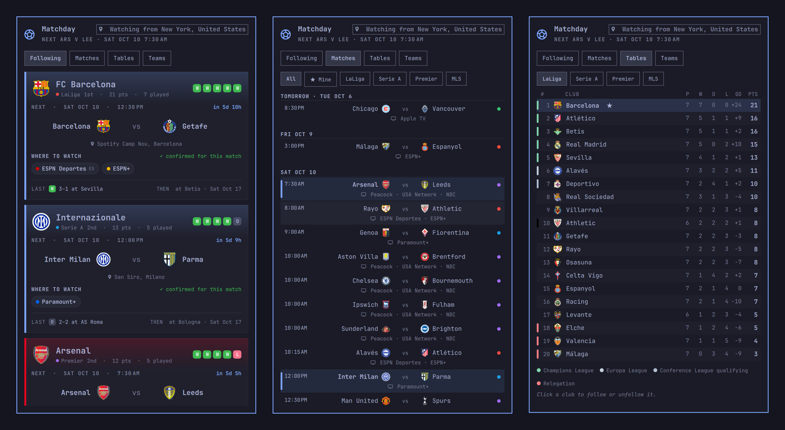

# Matchday (grivera.matchday)

Omarchy bar widget for **LaLiga, Serie A, the Premier League, MLS and the UEFA
Nations League**. You can follow your clubs and national teams and see live scores,
fixtures and league tables. For every match it shows **where to watch it from where
you are**.



## Install

Use Omarchy's plugin manager:

```
omarchy plugin add https://github.com/grivera82/omarchy-matchday.git --enable
```

This clones the plugin into `~/.config/omarchy/plugins/grivera.matchday`, checks
it, and adds the widget to your bar. When run interactively, it asks which bar
section to use (default: right). Without `--enable`, you can turn it on later with:

```
omarchy plugin enable grivera.matchday --section right
```

There's no setup and no API key. Open the panel, go to **Teams**, and click the
clubs you want to follow.

To update or uninstall:

```
omarchy plugin update grivera.matchday
omarchy plugin disable grivera.matchday   # hide it but keep it installed
omarchy plugin remove grivera.matchday    # delete it
rm -rf ~/.cache/grivera-matchday ~/.local/state/grivera-matchday   # optional: cached data and settings
```

The plugin writes only to those two folders. It reads
`~/.config/grivera-matchday/broadcasters.json` if you create one, and never writes
to it.

### Dependencies

- Python 3 (standard library only), `notify-send`, and `xdg-open` (or
  Omarchy's `omarchy-launch-webapp`) to open links. Omarchy already includes all of
  these.
- Network access to ESPN's public site API (`site.api.espn.com`) for fixtures,
  scores and tables, and to `a.espncdn.com` for crests. No account or key is
  needed. Matchday isn't affiliated with ESPN or any league or broadcaster.

## Bar widget

- The **ball** sits in the bar. A small accent dot means one of your teams plays
  within 12 hours. The dot turns red and breathes while one of them is playing.
- While your team is live, the bar shows the score: `󰒸  BAR 2–1 GET  67'`
  (this can be switched off).
- **Left click**: open the panel. **Right click** (while live): open the match on
  ESPN. **Middle click**: refresh.

## Panel

| Tab | What's there |
|---|---|
| **Following** | One card per club: crest, league position, points, last-five form, then the next match (or the live one) with countdown, venue, **where to watch**, last result and the match after. Live cards show the score, minute, goals and red cards. Other live games appear underneath. |
| **Matches** | Every game over the next 10 days and the last 3, grouped by day, filtered by All / ★ Mine / league. Each row shows its channels. Click a row to open it on ESPN. |
| **Tables** | Standings with European and relegation zones (MLS split by conference, Nations League by its 14 groups, with the groups you follow first). Click a team to follow or unfollow it. |
| **Teams** | Crest grid for picking your clubs, plus settings. |

Keys: `1`–`4` switch tabs, `h`/`l` cycle the league filter, `j`/`k` scroll, `r`
refreshes.

## Where to watch

Your country comes from the system timezone (`America/New_York` means the United
States). You can override it under **Teams → Settings → Watching from**.

- **United States**: ESPN publishes US channels for each match, usually within a
  week of kickoff. Those channels are marked *✓ confirmed for this match*. Until
  then, the card lists the league's rights holders.
- **Everywhere else**: the card lists the 2026-27 rights holders from
  `lib/broadcasters.json`. Built in: US, Canada, Mexico, UK, Ireland, Spain, Italy.
  Apple TV carries MLS worldwide. Entries I couldn't confirm against a 2026-27
  source are labelled *unconfirmed*.
- **Nations League**: national-team rights follow who's playing. In the UK,
  England is on ITV, Scotland and Northern Ireland on BBC iPlayer, Wales on S4C
  and everything else on Prime Video. Ireland's matches are on RTÉ, Spain's on
  RTVE. These come from UEFA's 2026/27 broadcaster list.

Click a channel pill to open that service. You can hide Spanish-language channels
(Telemundo, Universo, ESPN Deportes, FOX Deportes and others) with the toggle.

To fix an entry or add your country, create
`~/.config/grivera-matchday/broadcasters.json`. It's merged over the built-in
table, then press Refresh:

```json
{
  "services": { "dazn-de": { "name": "DAZN", "url": "https://www.dazn.com/", "color": "#f7ff1a", "kind": "stream" } },
  "countries": { "DE": { "name": "Germany", "esp.1": ["dazn-de"], "ita.1": ["dazn-de"] } }
}
```

For national-team rights that depend on who's playing, give a league an object
with `services` (everyone else) and `teams` (ESPN team abbreviation → services):

```json
{
  "services": { "ard": { "name": "ARD / ZDF", "url": "https://www.ardmediathek.de/", "color": "#0a3b7c", "kind": "free" } },
  "countries": { "DE": { "name": "Germany", "uefa.nations": { "services": ["dazn-de"], "teams": { "GER": ["ard"] } } } }
}
```

## Notifications

These only fire for the clubs you follow, and each one can be switched off:

- **Kickoff reminder** 15 minutes before, with where to watch
- **Goal**, with the scorer and minute ("GOAL!" when it's your side)
- **Full time**, with the result

Clicking a notification opens the match on ESPN.

## Polling

- Day scoreboards for each league: every 30 s while a match is live or about to
  start, every 5 min for today and tomorrow otherwise, every 30 min for later days
- Tables: hourly (every 10 min on live days)
- Your clubs' full schedules: every 3 h

Responses and crests are cached in `~/.cache/grivera-matchday/`, so the panel
fills instantly after a restart. Settings are in
`~/.local/state/grivera-matchday/config.json`.

## CLI

```
bin/matchday status [--json]   # your clubs' next matches + where to watch, today's games
bin/matchday next              # one line, handy for scripts
bin/matchday daemon            # what the shell runs: JSON lines in and out
```
